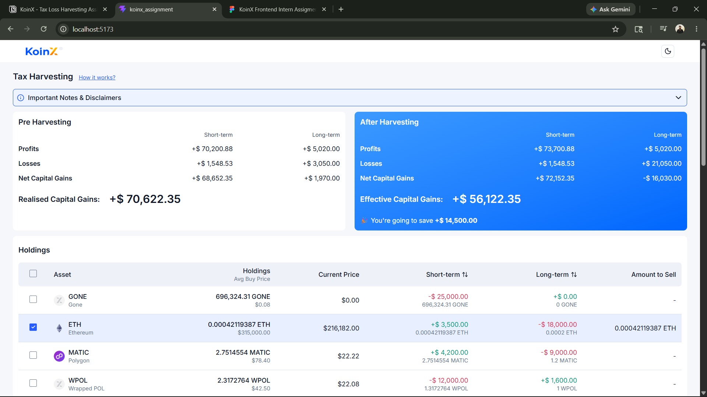

# KoinX Tax Harvesting Dashboard

A React + TypeScript implementation of a tax harvesting dashboard. The app shows pre-harvesting and after-harvesting capital gains, lets users select holdings for harvesting, and updates the effective gains and estimated savings in real time.

## Features

- Pre-harvesting capital gains summary
- After-harvesting summary based on selected holdings
- Select/deselect individual holdings
- Select/deselect all holdings
- Sort holdings by short-term and long-term gains
- View all/view less holdings table
- Loader and error states for mocked API calls
- Dark/light theme toggle
- Responsive table layout

## Tech Stack

- React
- TypeScript
- Vite
- Tailwind CSS
- Lucide React
- Mock API using promises

## Setup Instructions

Install dependencies:

```bash
npm install
```

Start the development server:

```bash
npm run dev
```

Build for production:

```bash
npm run build
```

Run lint checks:

```bash
npm run lint
```

Preview the production build:

```bash
npm run preview
```

## Screenshots

Add your screenshots inside `src/assets/screenshots`.

Example structure:

```text
src/assets/screenshots/
  dashboard-dark.png
  dashboard-light.png
```

Then uncomment or update the image links below:

<!--
### Dashboard - Dark Mode

![Tax Harvesting Dashboard - Dark Mode]
(./src/assets/screenshots/ss-1.png)
(./src/assets/screenshots/ss-2.png)(./src/assets/screenshots/ss-3.png)(./src/assets/screenshots/ss-4.png)(./src/assets/screenshots/ss-5.png)(./src/assets/screenshots/ss-6.png)

### Dashboard - Light Mode


-->

## Assumptions

- API responses are mocked locally using promise-based functions.
- Selecting a holding means the full holding amount is considered for harvesting.
- Positive holding gains are added to profits.
- Negative holding gains are added to losses as absolute values.
- Estimated savings are shown only when post-harvesting realised gains are lower than pre-harvesting realised gains.
